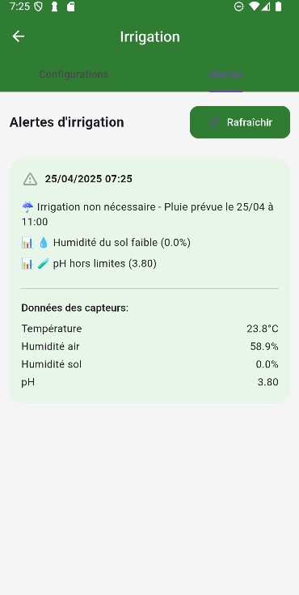

# 🌾 AGRINOVA — Smart Farm Management

<div align="center">

**An intelligent IoT-powered farm management platform built with Flutter**

[](https://flutter.dev)
[](https://firebase.google.com)
[](https://www.espressif.com)

</div>

---

## 📱 Screenshots

<table>
  <tr>
    <td align="center"><b>Home</b><br></td>
    <td align="center"><b>Irrigation</b><br></td>
    <td align="center"><b>Weather</b><br></td>
  </tr>
  <tr>
    <td align="center"><b>Marketplace</b><br></td>
    <td align="center"><b>Disease Detection</b><br></td>
    <td align="center"><b>Robot Control</b><br></td>
  </tr>
  <tr>
    <td align="center" colspan="3"><b>Agribot</b><br></td>
  </tr>
</table>

> 💡 Ajoutez vos captures d'écran dans `docs/screenshots/` avec les noms : `home.png`, `irrigation.png`, `weather.png`, `marketplace.png`, `disease.png`, `robot.png`, `agribot.png`

---

## 📋 Overview

**AGRINOVA** is a comprehensive smart agriculture application that enables farmers to monitor, automate, and optimize their operations through real-time IoT sensor data, intelligent irrigation control, weather integration, and AI-assisted crop disease detection.

Built with **Flutter** for cross-platform deployment (Android & iOS), the app connects to **ESP32** microcontrollers for sensor data acquisition and actuator control, while leveraging **Firebase** for authentication and cloud services.

---

## ✨ Key Features

### 🌡️ **IoT Dashboard**
- Real-time monitoring of environmental sensors: temperature, humidity, soil moisture, water level, pH
- Flame detection alerts for enhanced safety
- Interactive charts and sensor visualizations
- Automatic data refresh with retry logic

### 💧 **Smart Irrigation**
- Remote pump control via ESP32
- Configurable irrigation schedules and zones
- Weather-based automation (skip watering when rain is forecasted)
- Irrigation history and water volume tracking

### 🤖 **Agricultural Robot (Agribot)**
- Joystick-based robot control
- AI-powered plant disease detection
- Disease history and diagnostics records

### 🌤️ **Weather Integration**
- Location-based weather forecasts
- Weather-aware irrigation decisions
- Historical weather data

### 📊 **Finance & Market**
- Transaction tracking and financial summaries
- Crop-specific financial statistics
- Farmer marketplace for buying and selling products

### 🌱 **Crop Management**
- Crop lifecycle tracking (planting → harvest)
- Area and status management
- Integration with irrigation zones

### 🔐 **Authentication**
- Firebase Authentication
- Google Sign-in
- Multi-role user support

---

## 🛠️ Tech Stack

| Layer | Technology |
|-------|------------|
| **Framework** | Flutter 3.0+ |
| **State Management** | Provider |
| **Backend** | Firebase (Auth) |
| **Local Database** | SQLite (sqflite) |
| **IoT Hardware** | ESP32 (HTTP API) |
| **Maps** | Google Maps Flutter |
| **Charts** | fl_chart |
| **Localization** | French (fr_FR) |

---

## 📁 Project Structure

```
lib/
├── main.dart                 # App entry point, providers, Firebase init
├── routes.dart               # Navigation routes
├── theme/
│   └── app_theme.dart        # Theming
├── models/                   # Data models
├── providers/                # State management (Provider)
├── screens/                  # UI screens
│   ├── auth/                 # Authentication
│   ├── home/                 # Dashboard
│   ├── iot/                  # IoT sensor dashboard
│   ├── irrigation/           # Irrigation control & config
│   ├── robot/                # Robot & disease detection
│   ├── market/               # Marketplace
│   ├── finance/              # Financial management
│   ├── crops/                # Crop management
│   └── weather/              # Weather screens
├── services/                 # Business logic & APIs
│   ├── esp32_service.dart    # ESP32 HTTP client
│   ├── weather_service.dart
│   ├── database_service.dart
│   └── ...
└── widgets/                  # Reusable UI components
```

---

## 🚀 Getting Started

### Prerequisites

- [Flutter SDK](https://flutter.dev/docs/get-started/install) (3.0+)
- [Firebase project](https://console.firebase.google.com) with Auth enabled
- ESP32 device with compatible firmware (HTTP API on port 80)

### Installation

1. **Clone the repository**
   ```bash
   git clone https://github.com/maramfarhat/AgriNova.git
   cd AgriNova
   ```

2. **Install dependencies**
   ```bash
   flutter pub get
   ```

3. **Configure Firebase**
   - Add `google-services.json` (Android) and `GoogleService-Info.plist` (iOS) to the project
   - Enable Firebase Authentication and Google Sign-in in the Firebase Console

4. **Configure ESP32**
   - Update the ESP32 IP address in `lib/services/esp32_service.dart`:
     ```dart
     static const String baseUrl = 'http://YOUR_ESP32_IP';
     ```

5. **Run the app**
   ```bash
   flutter run
   ```

---

## 🔧 ESP32 Integration

The app communicates with an ESP32 via HTTP. Expected endpoints:

| Endpoint | Method | Description |
|----------|--------|-------------|
| `/data` | GET | Returns JSON with `temperature`, `humidity`, `soil_moisture_percent`, `water_level_percent`, `ph_value`, `flame_detected` |
| `/control` | POST | Body: `{"activate": true/false}` — Controls irrigation pump |
| `/weather` | POST | Body: `{"will_rain": true/false}` — Receives weather forecast for automation |

---

## 📄 License

This project is licensed under the MIT License — see the [LICENSE](LICENSE) file for details.

---

## 👤 Author

**MARAMFARHAT**

---

<div align="center">

Made with ❤️ for modern agriculture

</div>
